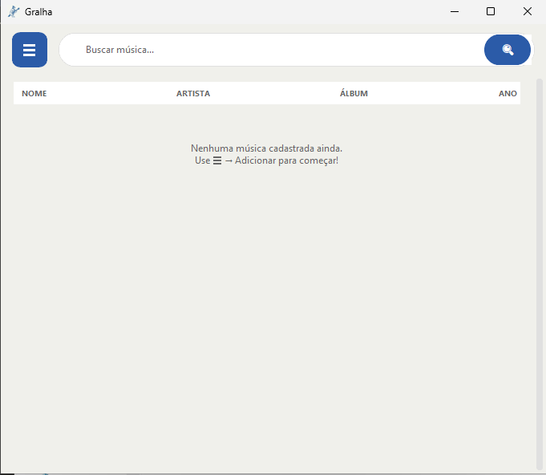
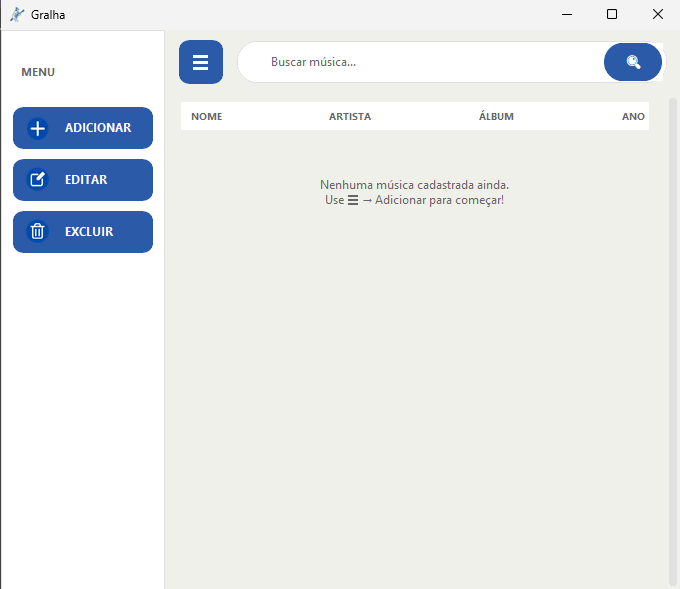

# 🐦 Gralha

> Biblioteca de músicas para guitarristas — tenha cifras, tablaturas, partituras e áudios sempre à mão.

---

## 🎯 Objetivo

Gralha nasceu da necessidade de ter um acervo musical organizado em um único lugar. O software permite cadastrar músicas com todas as informações relevantes para um guitarrista — cifra, tablatura, partitura e áudio — e acessá-las de forma rápida e intuitiva.

O nome é uma homenagem à **gralha-azul**, ave símbolo do Paraná conhecida por enterrar o pinhão e nunca esquecer onde plantou. Assim como você nunca vai perder suas músicas.

---

## ✨ Funcionalidades

- 🎵 Cadastro de músicas com nome, artista, álbum e ano
- 🎸 Armazenamento e visualização de cifras e tablaturas
- 📄 Vinculação de partituras em PDF
- 🔊 Vinculação de arquivos de áudio (MP3, WAV)
- 🔍 Busca inteligente em tempo real por nome, artista ou álbum
- 📋 Listagem completa do acervo em ordem alfabética
- ✏️ Edição e exclusão de músicas cadastradas
- 📂 Menu lateral retrátil

---

## 🖥️ Interface

### Tela inicial


### Menu lateral


---

## 🛠️ Tecnologias

| Tecnologia | Uso |
|---|---|
| Python 3.12 | Linguagem principal |
| CustomTkinter | Interface gráfica moderna |
| SQLite3 | Banco de dados local |
| Pillow | Carregamento de ícones e imagens |

---

## 🚀 Como instalar e rodar

### Opção 1 — Executável (recomendado)

1. Acesse a página de [Releases](../../releases)
2. Baixe o arquivo `Gralha.exe`
3. Execute — nenhuma instalação necessária

> ⚠️ Na primeira execução o Windows pode exibir um aviso de segurança. Clique em **"Mais informações" → "Executar assim mesmo"** para continuar.

---

### Opção 2 — Rodar pelo código fonte

**Pré-requisitos:** Python 3.12+

**1. Clone o repositório**
```bash
git clone https://github.com/seu-usuario/gralha.git
cd gralha
```

**2. Crie e ative o ambiente virtual**
```bash
python -m venv .venv
.venv\Scripts\activate
```

**3. Instale as dependências**
```bash
pip install customtkinter pillow
```

**4. Rode o programa**
```bash
python main.py
```

---

## 📁 Estrutura do projeto

```
gralha/
├── assets/
│   ├── icons/          # ícones dos botões
│   └── logo.png        # logo do software
├── database/
│   └── musicas.db      # banco de dados SQLite
├── interface/
│   ├── main_window.py
│   ├── add_music_window.py
│   └── edit_music_window.py
├── services/
│   └── music_service.py
└── main.py
```

---

*Desenvolvido com 🎸 e Python*
